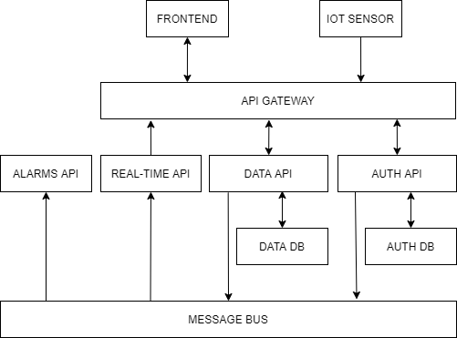

# docs

## [Sugo-code's Team](https://docs.google.com/document/d/1fzJBbMbpgdilmKepjGDhCHL-tAKCC7ea4lYjEOf3T00/edit#)

| Nome                  | Mail                                              | Ruolo             | Nome github                                           |
| --------------------- |:-------------------------------------------------:| -----------------:|  ----------------------------------------------------:|
| Bovolato Nicola       | nicola.bovolato@stud.tecnicosuperiorekennedy.it   |                   | [Nicola Bovolato](https://github.com/nicola-bovolato) |
| De Toni Sebastiano    | sebastiano.detoni@stud.tecnicosuperiorekennedy.it |                   |                                                       |
| Donadel Riccardo      | riccardo.donadel@stud.tecnicosuperiorekennedy.it  | Rappresentante    | [DemonDonny3](https://github.com/DemonDonny3)         |
| Furlan Giulio         | giulio.furlan@stud.tecnicosuperiorekennedy.it     |                   |                                                       |
| Zanetti Andrea        | andrea.zanetti@stud.tecnicosuperiorekennedy.it    |                   | [andreazanetti92](https://github.com/andreazanetti92) |

## [API Gateway](https://github.com/amazeen/api-gateway/wiki)
## [Alarms API](https://github.com/amazeen/alarms-api/wiki)
## [Data API](https://github.com/amazeen/data-api/wiki)
## [RealTime API](https://github.com/amazeen/realtime-api/wiki)
## [Auth API](https://github.com/amazeen/auth-api/wiki)
## [Data DB](./docs/data-db.md)
## [Auth DB](./docs/auth-db.md)
## [Message Bus](./docs/messase-bus.md)
